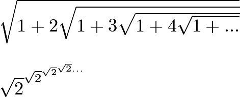
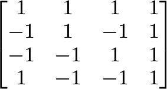

# Part 1: Documentation

1. Wiki created

2. https://github.com/roryeiffe/oss-lab3/wiki/Project-Introduction

3. 

$\sqrt{1+2\sqrt{1+3\sqrt{1+4\sqrt{1+...}}}}$

$\sqrt{2}^{\sqrt{2}^{\sqrt{2}^{\sqrt{2}...}}}$

4. 

$\begin{bmatrix}
1 & 1 & 1 & 1\\
-1 & 1 & -1 & 1\\
-1 & -1 & 1 & 1\\
1 & -1 & -1 & 1
\end{bmatrix}$

# Part 2: Community

1/2. I was unable to attend the lab synchronously so I picked the first 4 projects. 

3. 

4. 

## Organizer

### 4 contributors
### 42912 lines of code
### First Commit: db4084294c8bfb5b4f44238cf6f94cdf382cc7db
### Latest Commit: 0ac5bb1de332cb5336ab1b3098e282efbbbd415c
### branches
#### dummy
#### dependabot/npm_and_yarn/axios-0.21.1
#### dev
#### master
#### dependabot/npm_and_yarn/lodash.defaultsdeep-4.6.1
#### dependabot/npm_and_yarn/node-fetch-2.6.1
#### dependabot/npm_and_yarn/eslint-utils-1.4.3

