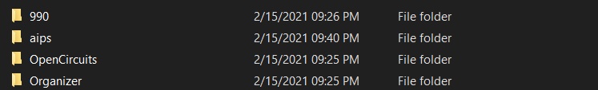
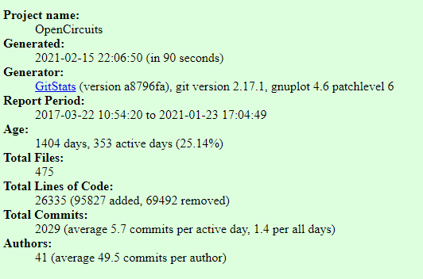
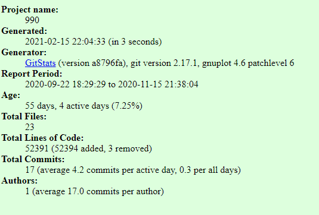
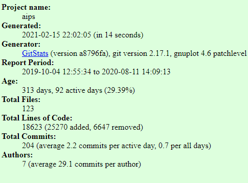

# Part 1: Documentation

1. Wiki created

2. https://github.com/roryeiffe/oss-lab3/wiki/Project-Introduction

3. 

$\sqrt{1+2\sqrt{1+3\sqrt{1+4\sqrt{1+...}}}}$

$\sqrt{2}^{\sqrt{2}^{\sqrt{2}^{\sqrt{2}...}}}$

4. 

$\begin{bmatrix}
1 & 1 & 1 & 1\\
-1 & 1 & -1 & 1\\
-1 & -1 & 1 & 1\\
1 & -1 & -1 & 1
\end{bmatrix}$

# Part 2: Community

1/2. I was unable to attend the lab synchronously so I picked the first 4 projects. 

3. 

4. 

## Organizer

### 4 contributors
### 42912 lines of code
### First Commit: db4084294c8bfb5b4f44238cf6f94cdf382cc7db
### Latest Commit: 0ac5bb1de332cb5336ab1b3098e282efbbbd415c
### branches
1. dummy
2. dependabot/npm_and_yarn/axios-0.21.1
3.  dev
4.  master
5.  dependabot/npm_and_yarn/lodash.defaultsdeep-4.6.1
6.  dependabot/npm_and_yarn/node-fetch-2.6.1
7.  dependabot/npm_and_yarn/eslint-utils-1.4.3

## OpenCircuits

### 33 contributors
### 26796 lines of code
### First Commit: c4a9e7d66d32391f9371a68a0749588a6218b5b3
### Latest Commit: 33296784ecf4fabf6b2439e04540049b15fcb26a
### branches
1. master
2. port-8081
3. AnalogWork
4. Browser-compatibility-(version,-etc.)
5. Documentation
6. ICLibrary
7. MUXLabel
8. MainTutorial
9. Optimizations
10. PlaceComponentFix
11. Replace_Component
12. SelectionToolTest
13. Snap_Options
14. TashBranch
15. TheReactor
16. UnitTests
17. VideoTutorialPage
18. all
19. db-versioning
20. expression-to-circuit

## aips

### 5 contributors
### 343217 lines of code
### First Commit: 3807b62ef2d425ca3bd964c0646a193a16a57e5a
### Latest Commit: f36be74b097a0d7ef38b7a986fb82613c5eb60bd
### branches
1. master
2. dependabot/npm_and_yarn/axios-0.21.1
3. dependabot/npm_and_yarn/ini-1.3.8
4. deploy
5. feat/event_image_upload
6. imprv/blog_slider
7. imprv/documentation
8. imprv/keyboard_accessibility
9. list_feature
10. private_feature

## 990 

### 1 contributor
### 52372 lines of code
### First Commit: 4d290af3a00b445443e66452fa26f41dcafe8083
### Latest Commit: 271c92a2efa6e6836188bfee8843dec48bb3e1d8
### branches
1. master

5. 

gitstats ./Organizer ./Organizer_out